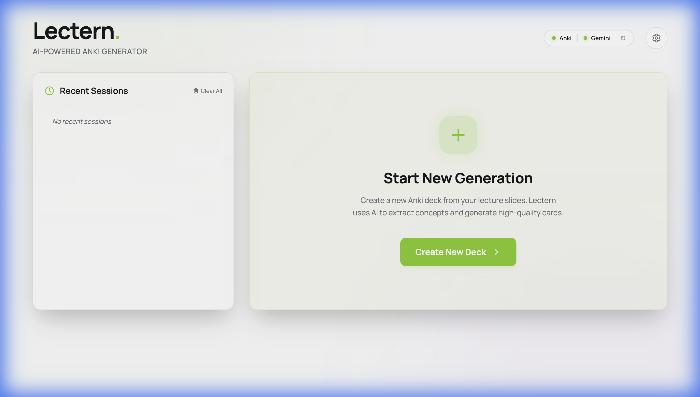
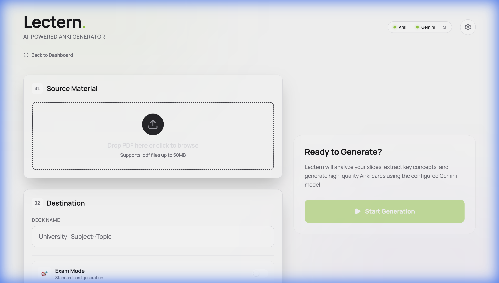

 <div align="center">

# LECTERN

**AI-Powered Anki Card Generator**

[](https://opensource.org/licenses/MIT)
[](https://www.python.org/)
[](https://github.com/psf/black)

<br>

Lectern transforms PDF lecture slides into high-quality Anki flashcards instantly.  
It parses your slides, composes a multimodal prompt for Google's Gemini, and creates notes in your running Anki instance via AnkiConnect.

[Get Started](#installation) • [Usage](#usage) • [Tech Stack](#tech-stack) • [Configuration](#configuration)

<br>



</div>

---

## Features

- **Multimodal Analysis**  
  Extracts text and images from slides using `PyMuPDF`, preserving context for accurate generation.

- **Smart Generation**  
  Leverages **Gemini 3.0 Flash** to create atomic, well-structured cards that adhere to learning best practices.

- **Style Matching**  
  Intelligently samples existing cards to match your deck's aesthetic and formatting.

- **Dual Interface**  
  - **Native GUI:** A standalone desktop app (via `pywebview`) with a modern React/Tailwind frontend.
  - **Power CLI:** A robust command-line interface for batch processing and automation.

- **Safe Execution**  
  Operates exclusively via the AnkiConnect API, ensuring your collection files remain untouched.

---

## Tech Stack

Lectern is built with a modern, type-safe, and performant stack:

- **AI Core:** Google Gemini 3.0 Flash  (Multimodal)
- **Backend:** Python, FastAPI, Uvicorn
- **Frontend:** React, TypeScript, Vite, Tailwind CSS, Framer Motion
- **Desktop Wrapper:** PyWebView (Cocoa/WebKit)
- **PDF Engine:** PyMuPDF
- **CLI Utilities:** Rich, Keyring

---

## Installation

### Prerequisites

- **Python 3.9+**
- **Anki** with [AnkiConnect](https://ankiweb.net/shared/info/2055492159) installed.
- **Gemini API Key** from [Google AI Studio](https://aistudio.google.com/api-keys).

### Setup

```bash
# Clone the repository
git clone https://github.com/yourusername/lectern.git
cd lectern

# Create virtual environment
python -m venv .venv && source .venv/bin/activate

# Install dependencies
pip install -r requirements.txt
```

### Build from Source

To create a standalone macOS application (`Lectern.app`):

```bash
./build_app.sh
```
The artifact will be available in `dist/Lectern.app`.

---

## Usage

### 1. Setup API Key

You can store your API key securely in the system keychain (recommended) or use a `.env` file.

**Option A: System Keychain (Secure)**
```bash
python main.py --set-key
# Follow the prompt to enter your Gemini API Key
```

**Option B: Environment File**
```bash
cp .env.example .env
# Edit .env and add GEMINI_API_KEY=...
```

### 2. Graphical Interface

The recommended way to use Lectern. Launches a native window with a modern UI.

```bash
python gui/launcher.py
```



### 3. Command Line

For automation, batch processing, and headless environments.

```bash
# Basic usage
python main.py --pdf-path /path/to/slides.pdf --deck-name "Target Deck"

# With style matching from another deck
python main.py \
  --pdf-path lecture_01.pdf \
  --deck-name "Biology 101" \
  --context-deck "Biology 101::Previous" \
  --verbose
```

**Common Flags:**
- `--interactive`: Prompts for missing arguments.
- `--exam-mode`: Prioritizes application and comparison cards.
- `--estimate`: Calculates token usage and estimated cost without generating.
- `--quiet`: Minimal output.

---

## Logs

Lectern writes AI session logs to a fixed location:

- **Path (macOS):** `~/Library/Application Support/Lectern/logs/session-*.json`
- **When created:** At the start of each AI session.
- **What they contain:** Request/response snapshots for concept map, generation, and reflection.
- **When to check:** If card generation fails, reflection errors occur, or you need to inspect prompts/responses.

---

## Configuration

Configure defaults in `.env` or override via flags.

| Variable | Description | Default |
| :--- | :--- | :--- |
| `GEMINI_API_KEY` | **Required**. (Or set via `main.py --set-key`) | - |
| `ANKI_CONNECT_URL` | URL of AnkiConnect API. | `http://localhost:8765` |
| `BASIC_MODEL_NAME` | Anki Note Type for basic cards. | `prettify-nord-basic` |
| `CLOZE_MODEL_NAME` | Anki Note Type for cloze cards. | `prettify-nord-cloze` |

---

## Documentation & Contribution

- **[System Architecture](docs/ARCHITECTURE.md):** A high-level overview of how Lectern works under the hood.
- **[Contributing Guide](CONTRIBUTING.md):** Guidelines for developers who want to improve Lectern.
- **[Frontend Docs](gui/frontend/README.md):** Specific documentation for the React-based GUI.

<br>

<div align="center">
  <sub>Built by Steffen</sub>
</div>
