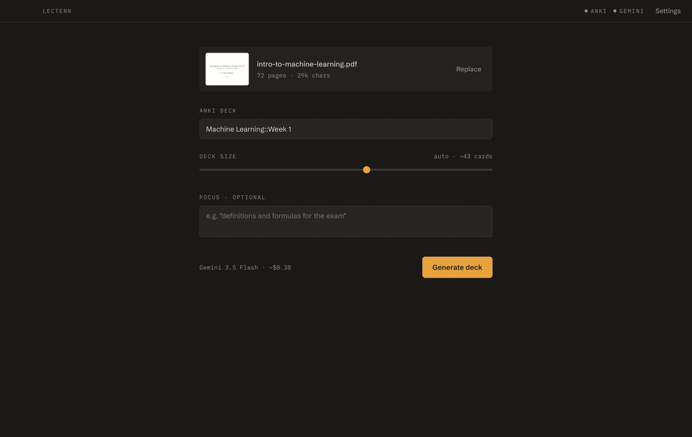
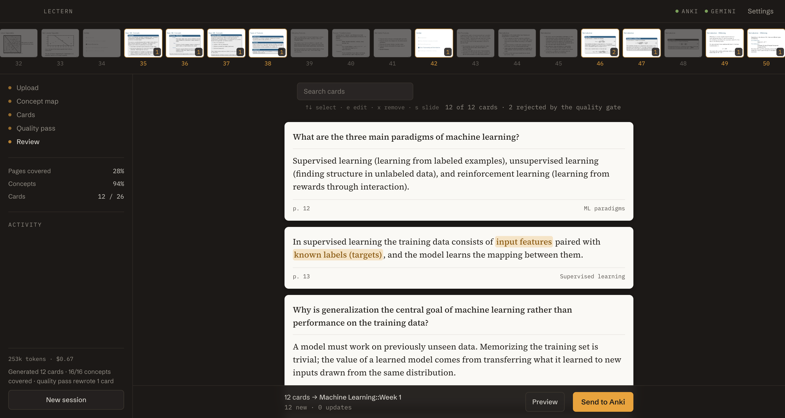
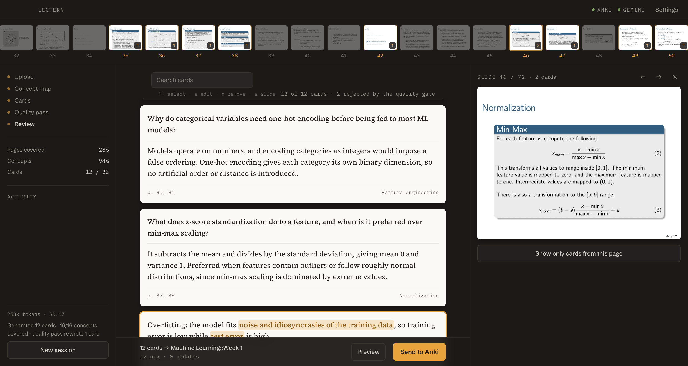

<div align="center">

# Lectern

**Turn lecture PDFs into Anki flashcards you can trust.**

[](https://github.com/stegra05/Lectern/actions/workflows/ci.yml)
[](https://github.com/stegra05/Lectern/releases)
[](LICENSE)




</div>

Drop a lecture PDF on the desk. Lectern has Gemini read the whole document, build
a concept map, and generate flashcards agentically: the model plans its own
batches, and after each one it sees a coverage ledger of which pages and concepts
still lack cards. Every card must cite the pages it came from and pass a quality
gate before it enters your deck. Review, edit, and send to Anki in one click.

## Why not just paste slides into a chatbot?

Because you can't trust the output. At 400 cards a semester, nobody verifies
every card by hand, so Lectern makes the checking visible instead:

- **Grounded cards.** Every card carries provenance: source pages, the concept it
  teaches, and a source excerpt. Cards without support are rejected, and the log
  shows what was cut and why.
- **Coverage you can see.** The filmstrip shows your actual slides and lights
  them up as cards cover them. Uncovered pages stay dim, so gaps are obvious.
- **Check the source in place.** Click a card's page reference and the original
  slide opens next to it.
- **A quality pass at the end.** The model reviews the whole deck and rewrites
  weak cards. Every edit passes the same gate.
- **Your data, your key.** No account, no server, no subscription. The app calls
  the Gemini API directly with your key, which lives in the OS keychain. A
  typical 70-page lecture costs between a few cents and about a dollar.

<div align="center">

<br/><br/>

</div>

## Install

**[Download the latest release](https://github.com/stegra05/Lectern/releases/latest)**
for macOS (Apple Silicon and Intel), Windows, or Linux.

Or build from source:

```sh
git clone https://github.com/stegra05/Lectern.git
cd Lectern && pnpm install && pnpm tauri build
```

## Getting started

1. Install [Anki](https://apps.ankiweb.net/) and the
   [AnkiConnect](https://ankiweb.net/shared/info/2055492159) add-on, and keep Anki
   running.
2. Get a free [Gemini API key](https://aistudio.google.com/apikey) and add it in
   Lectern's settings (⌘,). It is stored in your OS keychain, never on disk.
3. Drop a lecture PDF on the desk, name the target deck, and hit **Generate deck**.
4. Watch the filmstrip light up. When generation finishes, review and edit the
   cards. Each one shows the pages it came from.
5. **Send to Anki.** Re-running a lecture updates existing notes instead of
   creating duplicates.

## How it works

```
PDF ──▶ concept map ──▶ agentic generation ──▶ quality pass ──▶ your review ──▶ Anki
        objectives,      Gemini submits card     whole-deck       edit, search,
        concepts,        batches via tool        review loop;     filter by page,
        relations,       calls; each batch is    every edit       peek at slides
        per page         gated + answered with   re-gated
                         a coverage ledger
```

The pipeline runs entirely in-process. There is no backend and no account, and
nothing leaves your machine except the calls to the Gemini API and to your local
Anki. The whole engine is about 6k lines of TypeScript including tests:

```
src/engine/          the pipeline (pure TS, no UI imports)
  pipeline.ts        three phases: concept map → agentic generation → reflection
  gemini.ts          Gemini Interactions API client (upload, tool loop, retry)
  coverage.ts        the coverage ledger the model steers by
  quality.ts         grounding gate: provenance + quality checklist
  anki.ts            AnkiConnect client, duplicate-safe sync
src/state/store.ts   one Zustand store; pipeline events land as direct writes
src/components/      the UI ("evening lecture hall" design system)
src-tauri/           thin Rust shell: keychain, CORS-free fetch, dialogs
```

## Development

```sh
pnpm install
pnpm tauri dev        # full desktop app
pnpm dev              # browser-only dev mode (Tauri APIs fall back to web equivalents)

pnpm test             # unit tests (offline)
pnpm typecheck
GEMINI_API_KEY=... pnpm vitest run src/engine/pipeline.live.test.ts   # live E2E incl. Anki
```

See [CONTRIBUTING.md](CONTRIBUTING.md) for setup details and code layout.

## History

Lectern 2 is a from-scratch rebuild of a Python/FastAPI/PyWebView app that grew
to about 40k lines before teaching its lessons. What broke, what survived, and
why the rebuild is 6k lines with no backend is written up in
[docs/history.md](docs/history.md). The original lives on the
[`v1`](https://github.com/stegra05/Lectern/tree/v1) branch.

## License

[MIT](LICENSE) © Steffen Grabert
