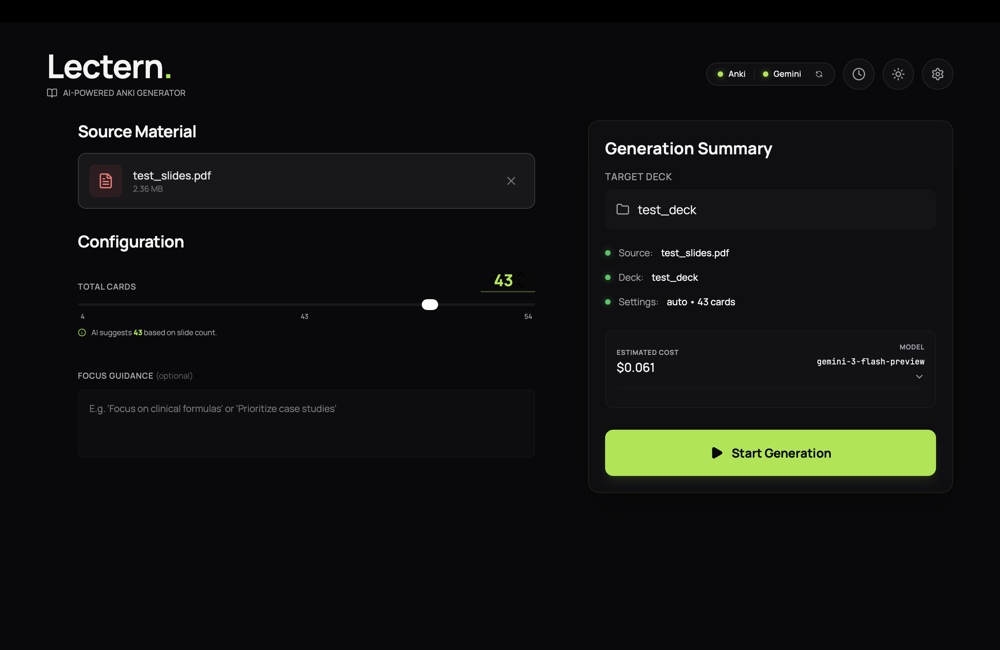
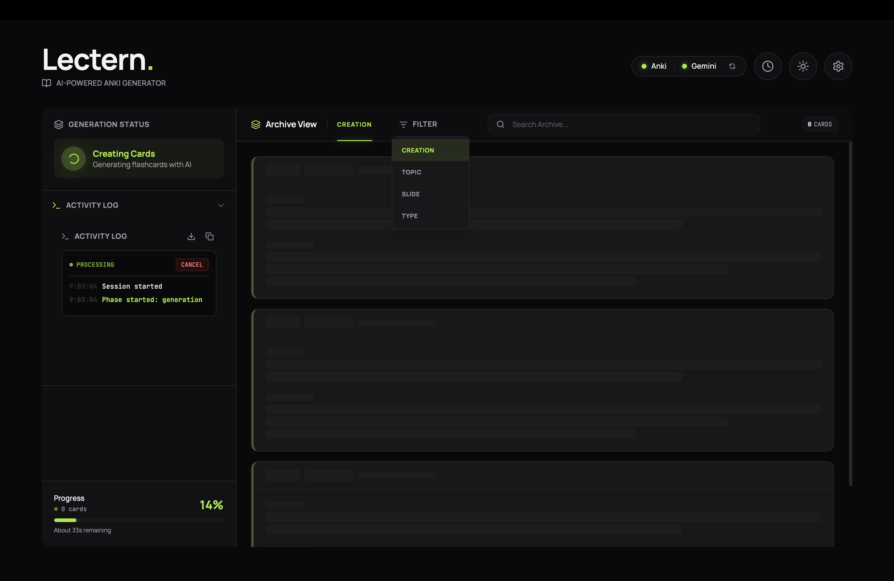
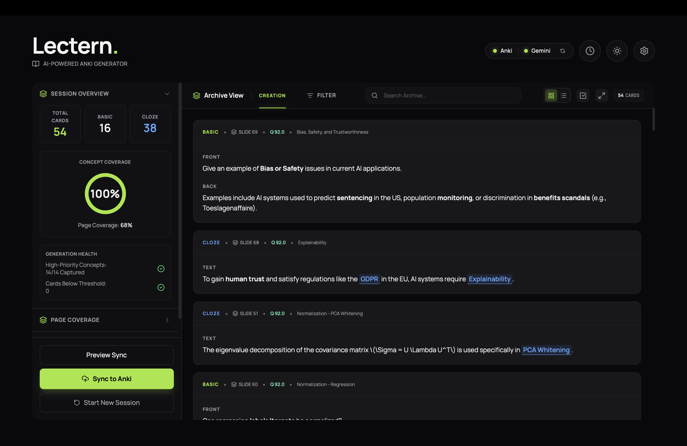
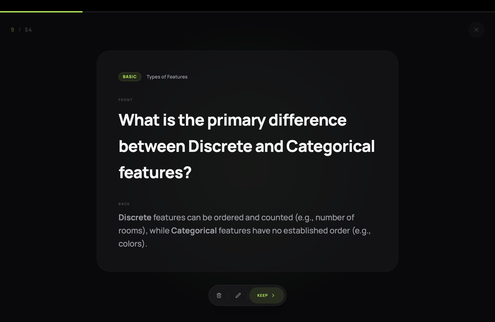

# Lectern

**AI-Powered Anki Card Generator**

 

Lectern transforms PDF lecture slides into high-quality Anki flashcards instantly. It parses your slides, composes a multimodal prompt for Google's Gemini, and creates notes in your running Anki instance via AnkiConnect.

 

---

## Overview

Lectern is designed for students and professionals who need to rapidly convert structured documents into spaced-repetition material. By leveraging multimodal AI, it goes beyond simple text extraction to understand visual context, ensuring high-quality, concept-driven flashcard generation. The application features a clean, native desktop experience with real-time progress tracking and a dedicated review interface.

---

## Features

### Real-Time Generation
Stream cards directly into the application as they are generated, with dynamic pacing and concept mapping to ensure comprehensive coverage.

### Intelligent Review
Review generated cards, monitor page and concept coverage, and selectively sync them to your Anki database.

### Focused Editing
A clean, minimal interface for editing cards before finalizing them in your collection.

---

## Quick Start

**[Download Lectern (macOS / Windows / Linux)](https://lectern.steffengrabert.com)**

1. Open the downloaded application. (On macOS, right-click and select "Open" on first launch).
2. Install the [AnkiConnect](https://ankiweb.net/shared/info/2055492159) add-on in Anki.
3. Open Settings and enter your [Gemini API Key](https://aistudio.google.com/apikey).
4. Drop a PDF into Lectern and start generating.

For full user documentation, troubleshooting, and guides, visit the [Lectern Landing Page](https://lectern.steffengrabert.com).

---

## Developer Guide

Welcome to the codebase. We maintain a comprehensive, centralized Wiki in the `docs/` folder.

- **[System Architecture](docs/ARCHITECTURE.md):** The 10,000-foot view (diagrams, data flow).
- **[Development Guide](docs/DEVELOPMENT.md):** Local setup, running the app, testing, and CI/CD.
- **[Design System](docs/DESIGN_SYSTEM.md):** The UI/UX philosophy and Tailwind conventions.
- **[AI Pipeline](docs/AI_PIPELINE.md):** Gemini integration, the 3-phase loop, and pacing strategy.
- **[Frontend Architecture](docs/FRONTEND.md):** React, Zustand state management, and V2 NDJSON event streaming.
- **[Backend Architecture](docs/BACKEND.md):** FastAPI routing, PyWebView wrapper, and AnkiConnect.

 

  Built by Steffen

