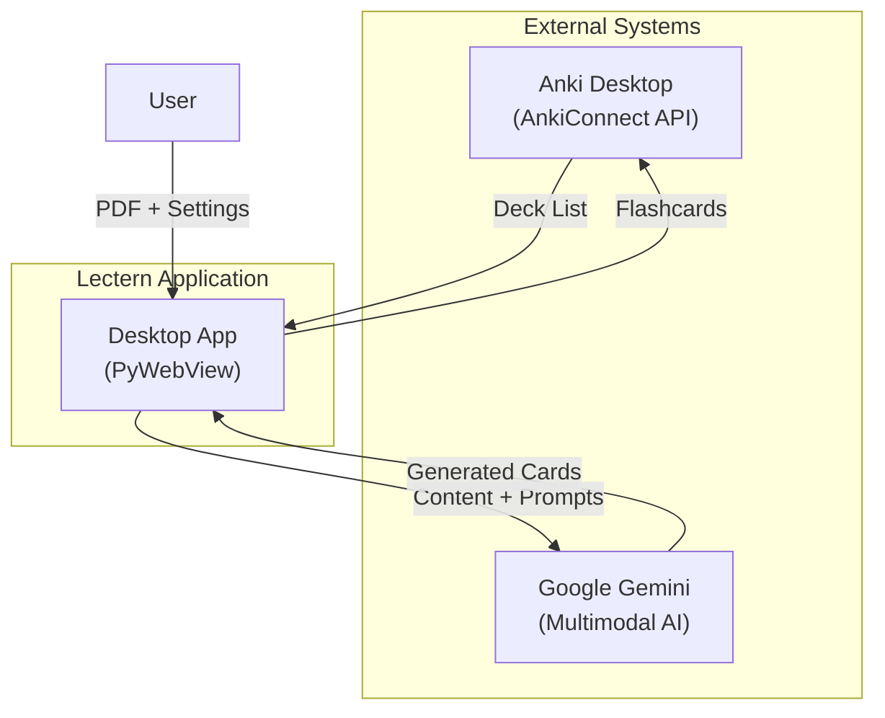
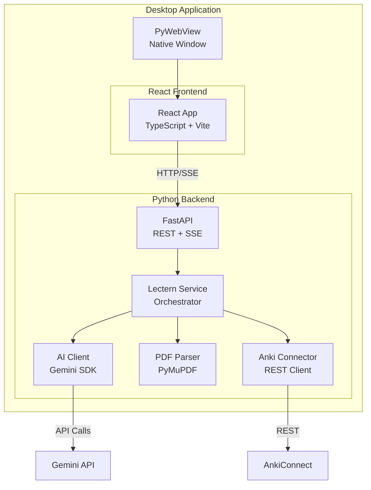
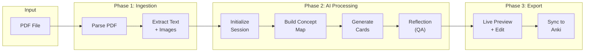
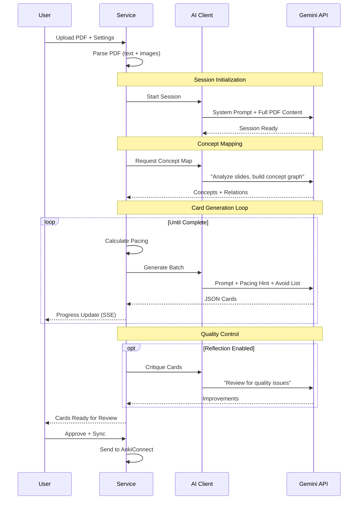

# System Architecture

Lectern is designed as a modular pipeline that transforms unstructured lecture slides into structured knowledge objects (Anki cards).

## System Context



## Container Architecture



## Data Flow Pipeline



## Generation Session Flow



## Core Components

### PDF Parser (`pdf_parser.py`)

Extracts content from lecture slides for multimodal prompting.

| Responsibility | Implementation |
| :--- | :--- |
| Text extraction | PyMuPDF page-by-page parsing |
| Image extraction | Convert to base64 for AI prompts |
| Page tracking | Preserve slide numbers for citation |

### AI Client (`ai_client.py`)

Interfaces with Google Gemini for intelligent card generation.

| Responsibility | Implementation |
| :--- | :--- |
| Multimodal prompting | Send text + images together |
| Prompt management | Centralized in `ai_prompts.py` |
| Concept mapping | First pass builds knowledge graph |
| Iterative generation | Batch cards with history tracking |
| Rate limiting | Coordinated by `ai_pacing.py` |
| Self-correction | Reflection step for quality |

### Service Layer (`lectern_service.py`)

Central orchestrator managing the generation pipeline.

| Responsibility | Implementation |
| :--- | :--- |
| State management | Track generation progress |
| Event emission | SSE for real-time UI updates |
| Resume support | Persist state for recovery |
| Pacing strategy | Adjust density based on content |

### GUI (`gui/`)

Desktop application with modern React frontend.

| Layer | Technology |
| :--- | :--- |
| Window | PyWebView (Cocoa/WebKit) |
| API | FastAPI + Uvicorn |
| Frontend | React + TypeScript + Vite |
| Styling | Tailwind CSS + Framer Motion |

## Data Models

### Anki Card

Abstract representation decoupled from Anki's internal format:

```json
{
  "model_name": "Basic",
  "fields": {
    "Front": "What is gradient descent?",
    "Back": "An optimization algorithm that iteratively adjusts parameters..."
  },
  "tags": ["lecture-1", "machine-learning"]
}
```

### Concept Map

Global context object guiding coherent generation:

```json
{
  "concepts": [
    {"id": "c1", "name": "Gradient Descent", "definition": "..."}
  ],
  "relations": [
    {"source": "c1", "target": "c2", "type": "optimizes"}
  ]
}
```

## Pacing Strategy

Lectern adapts its behavior based on content density:

| Content Type | Detection | Strategy |
| :--- | :--- | :--- |
| **Script** | > 3000 chars/page | Throttle based on text volume |
| **Normal** | 1000-3000 chars/page | Balanced approach |
| **Slides** | < 1000 chars/page | Page-count based |

## Security

| Concern | Approach |
| :--- | :--- |
| Anki data | Never write to SQLite directly; use AnkiConnect API only |
| API keys | Stored in system Keychain via `keyring`, never in config files |

## Logging

AI session logs for debugging and traceability:

- **Path:** `~/Library/Application Support/Lectern/logs/session-*.json`
- **Lifecycle:** Created at session start; appended after each phase
- **Use cases:** Debug generation quality issues, inspect prompts/responses
