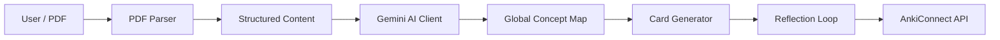

# System Architecture

Lectern is designed as a modular pipeline that transforms unstructured lecture slides into structured knowledge objects (Anki cards).

## High-Level Data Flow



## Core Components

### 1. PDF Parser (`pdf_parser.py`)
- **Role:** Extract text and images from slides.
- **Tech:** `PyMuPDF` (fitz).
- **Key Logic:**
    - Extracts text per page.
    - Extracts images and converts them to base64 for multimodal prompting.
    - Preserves page numbers for citation.

### 2. AI Client (`ai_client.py`)
- **Role:** Interface with Google's Gemini API.
- **Tech:** `google-genai` SDK.
- **Key Logic:**
    - **Multimodal:** Sends both text and slide images to the model.
    - **Concept Mapping:** First pass builds a JSON graph of concepts to ensure coherence.
    - **Iterative Generation:** Generates cards in batches, maintaining history to avoid duplicates.
    - **Reflection:** A self-correction step where the model critiques its own output.

### 3. Service Layer (`lectern_service.py`)
- **Role:** Orchestrator.
- **Responsibility:**
    - Manages the state of the generation process.
    - Emits events (SSE/Generators) for UI progress bars.
    - Handles "resume" functionality via state files.

### 4. Interfaces
- **CLI (`main.py`):** Direct interaction with the Service Layer.
- **GUI (`gui/`):**
    - **Backend:** FastAPI wrapper around the Service Layer.
    - **Frontend:** React application communicating via REST/SSE.

## Data Models

### The Anki Card
An abstract representation of a flashcard, decoupled from Anki's internal database format.

```json
{
  "model_name": "Basic",
  "fields": {
    "Front": "What is ...?",
    "Back": "It is ..."
  },
  "tags": ["lecture-1", "computer-vision"]
}
```

### The Concept Map
A global context object kept in the AI's "mind" (and saved to disk) to guide generation.

```json
{
  "concepts": [
    {"id": "c1", "name": "Gradient Descent", "definition": "..."}
  ],
  "relations": [
    {"source": "c1", "target": "c2", "type": "optimizes"}
  ]
}
```

## Security & Safety

- **AnkiConnect:** We treat Anki as an external service. We never write to the SQLite database directly. This prevents corruption.
- **API Keys:** Stored in the system Keychain (via `keyring`), never in plain text configuration files if possible.
