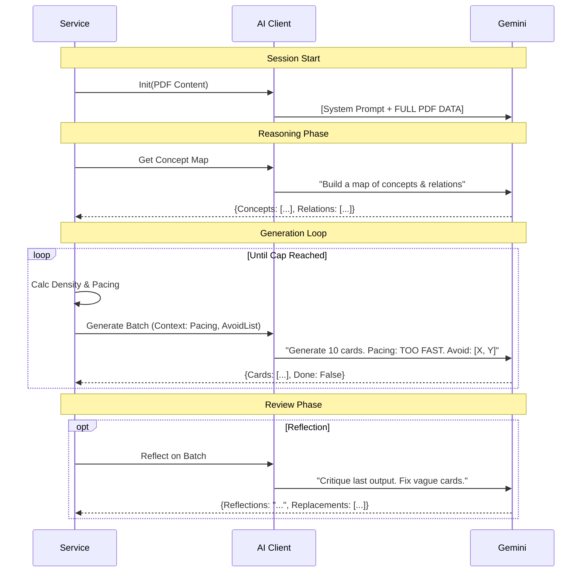

# Lectern System Overview

## 1. High-Level Architecture & Data Flow

The system is a linear pipeline with a feedback loop for quality assurance (Reflection).

```mermaid
graph TD
    User[User / GUI] -->|PDF & Settings| Service[Lectern Service]
    
    subgraph Phase1 [Phase 1: Ingestion]
        Service -->|Extract| Parser[PDF Parser]
        Parser -->|Text + Images| Service
        Service -->|Analyze| Pattern[Pattern Recognition]
        Pattern -- "Deck Structure" --> Service
    end
    
    subgraph Phase2 [Phase 2: AI Orchestration]
        Service -->|1. Init Session| AI[AI Client]
        AI -->|2. Send PDF Content| Gemini[Gemini 3 Flash]
        Gemini -->|3. Concept Map| AI
        
        loop "Generation Loop"
            Service -->|4. Request Batch| AI
            AI -->|"Prompt + Pacing Hint"| Gemini
            Gemini -->|JSON Cards| AI
            AI -->|Cards| Service
        end
        
        opt "Reflection (Quality Control)"
            Service -->|5. Critique Batch| AI
            AI -->|"Reflect & Fix"| Gemini
            Gemini -->|Improved Rules/Cards| AI
        end
    end
    
    subgraph Phase3 [Phase 3: Export]
        Service -->|Create Notes| Anki[AnkiConnect]
        Anki -->|Deck| User
    end
```

## 2. Operation Modes

Lectern adapts its behavior based on **User Intent** (Exam vs. Normal) and **Content Density** (Script vs. Slides).

### A. User Intent Modes
| Mode | Start Flag | Token Limit / Temp | Philosophy | Prompt Injection |
| :--- | :--- | :--- | :--- | :--- |
| **Normal** | Default | Temp: `0.7` | **"Coverage"** - Capture everything. Variety of card types. | `LATEX_STYLE_GUIDE` + `BASIC_EXAMPLES` |
| **Exam** | `exam_mode` | Temp: `0.4` | **"High Yield"** - Aggressive filtering. Only tough concepts. | `EXAM_PREP_CONTEXT` + "STRICTLY FILTER" instructions |

### B. Density Detection (Auto-Switching)
The system calculates `Chars Per Page` to guess the document type and adjust current caps.

| Detected Type | Threshold | Cap Strategy | Reasoning |
| :--- | :--- | :--- | :--- |
| **Script** | > 3000 chars/page | `Total Text / 800` | Dense text needs throttling based on reading load, not pages. |
| **Normal** | > 1000 chars/page | `Max(Pages*Target, Text/800)` | Balanced approach. |
| **Slides** | < 1000 chars/page | `Pages * Target` | Visual-heavy, text-light. Relies on page count. |

## 3. The LLM Context (What Gemini "Sees")

Gemini maintains a continuous chat session. It is **NOT** stateless.

### Turn 1: Initialization (The "Context Dump")
The very first message sent to Gemini contains:
1.  **System Instructions**: Role definition ("Expert Educator"), Output format rules (JSON), and Style Guides.
2.  **The Entire PDF**: All pages, text, and images (base64) are sent *once* at the start.

### Turn 2: Concept Map
*   **Prompt**: "Analyze the slides... construct a global concept map... identify 3 core objectives."
*   **Goal**: Forces the model to "read" the whole file and ground itself before generating cards.

### Turn 3..N: The Generation Loop
Repeated calls to `generate_more_cards`. Each prompt includes:
1.  **Core Instruction**: "Generate X cards..."
2.  **Global Anchor**: "Consult the Global Concept Map..."
3.  **Real-time Feedback ("Pacing Hint")**:
    > "Progress: Slide 10 of 40. Density is too high (3.0/slide). Increase filtering!"
4.  **Avoid List**: "Do not repeat these concepts: [List of previous card fronts]"
5.  **Tagging Context**: "Use this hierarchy: `Machine Learning::Supervised::[Topic]`"

### Turn N+1: Reflection (Optional)
*   **Prompt**: "You are a QA Specialist. Critique the last batch. Look for redundancy, vagueness. Return replacements."

## 4. Prompting Strategy Visualized


