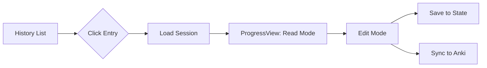

# Feature: Session Management (View/Edit Old Sessions)

## Summary
Allow users to view, edit, and re-sync cards from past generation sessions.

## Status: Refined

---

## Requirements

### View Old Sessions
- Click a history entry → Load its full session state
- Display cards in the same ProgressView used during generation
- Read-only initially, then edit mode

### Edit Cards
- Edit card text (Front/Back/Cloze text)
- Delete individual cards from session
- Add tags (optional, stretch goal)

### Sync Changes to Anki
- If cards were already pushed to Anki → Update via `updateNoteFields`
- If not yet synced → Normal push flow
- Requires tracking `note_id` returned from Anki on initial push

---

## Architecture

### Current State

```
history.json                       state/session-{id}.json
┌─────────────────┐                ┌────────────────────────┐
│ id              │                │ pdf_path               │
│ filename        │                │ deck_name              │
│ deck            │ ── links to ── │ cards: [...]           │
│ card_count      │                │ concept_map: {...}     │
│ status          │                │ history: [...]         │
│ date            │                └────────────────────────┘
└─────────────────┘
```

### Required Changes

1. **Link history entry to session state:**
   Add `session_id` field to history entries for explicit linkage.

2. **Store Anki note IDs:**
   When pushing to Anki, store returned `note_id` per card:
   ```json
   {
     "front": "...",
     "back": "...",
     "anki_note_id": 1234567890
   }
   ```

3. **New API Endpoints:**
   - `GET /session/{id}` — Load full session state
   - `PUT /session/{id}/cards` — Update cards in session
   - `POST /session/{id}/sync` — Sync changes to Anki

---

## UI Flow



### ProgressView Enhancements
- Add "Edit" button per card
- Add "Sync Changes" button (appears when edits detected)
- Visual indicator for cards already in Anki vs pending

---

## Technical Notes

### Anki Integration
AnkiConnect provides:
- `addNotes` → returns list of `note_id`s
- `updateNoteFields` → update existing note by `note_id`
- `deleteNotes` → delete by `note_id` list

### Session State Persistence
- State files already stored in `~/Library/Application Support/Lectern/state/`
- Need to ensure state isn't cleared after successful sync

---

## Open Questions

1. Should we auto-detect if cards have been modified in Anki directly?  
   *Recommendation: No for MVP, this adds significant complexity*

2. Conflict resolution if Anki card was deleted externally?
